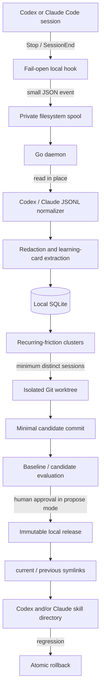

# SkillLoop

[](https://github.com/flemzord/skillloop/actions/workflows/ci.yml)
[](https://github.com/flemzord/skillloop/releases)
[](LICENSE)

SkillLoop turns recurring evidence from Codex and Claude Code sessions into small, tested, and reversible improvements to skills you own.

It does **not** train a model and it never edits a live skill in place. A fast local hook records lifecycle metadata, a separate daemon reads transcripts where they already live, and eligible lessons become isolated Git candidates. SkillLoop compares the baseline and candidate before a human can promote the candidate to an immutable local release.

> **Project status:** v0.1.0 is the first functional release. It implements local capture, normalization, learning cards, multi-session aggregation, isolated candidates, baseline/candidate evaluation, human promotion, and rollback. The default mode is `propose`. Review the [v0.1.0 limitations](#v010-limitations) before enabling `autopilot`.

## Why SkillLoop

Agent skills are usually improved from memory after something goes wrong. SkillLoop makes that feedback loop explicit:

- learn from repeated sessions instead of a single anecdote;
- attribute a lesson only when a successful, correlated provider tool result loaded the registered skill or read its exact registered `SKILL.md` path;
- produce the smallest possible change to `SKILL.md` in an isolated Git worktree;
- evaluate the exact baseline and candidate commits;
- keep promotion separate from the source checkout;
- switch back to the previous immutable release immediately.

## Architecture



The storage responsibilities are deliberately separate:

| Data | Location | Behavior |
| --- | --- | --- |
| Hook events | `$data_dir/spool` | Successful events are removed after ingestion; failed events remain under `failed/` for diagnosis. |
| Learning state | `$data_dir/skillloop.db` | SQLite stores session locators and outcomes, cards, clusters, jobs, proposals, evaluations, promotions, rollbacks, and an audit log. |
| Source transcripts | Codex or Claude's original path | Read in place. Transcript bodies are not copied into SQLite or the spool. |
| Candidate changes | `$data_dir/worktrees` | Created on a dedicated `skillloop/...` branch without staging, resetting, or cleaning the source checkout. |
| Promoted versions | `$data_dir/releases/<skill-id>` | Read-only snapshots selected by a serialized, crash-recoverable `current` / `previous` link pair. |

## Safety and privacy properties

- **Local-first:** v0.1.0 makes no network call in the capture, analysis, evaluation, promotion, or rollback pipeline. An external evaluator runs only when you configure one.
- **Fail-open hooks:** hook errors are intentionally swallowed so SkillLoop cannot block Codex or Claude Code. Hook input is limited to 1 MiB, written atomically, and the installed command has a one-second timeout.
- **Private state:** configuration and spool files use `0600`; local state directories use `0700`; SQLite uses WAL, foreign keys, and a single local writer. SQLite state is accepted only beneath root-owned, user-owned, or sticky directory ancestors. Improvement worktrees, evaluations, releases, locks, and journals remain anchored to authenticated directory descriptors; symlinked state-path components are rejected instead of followed.
- **No transcript duplication:** only the transcript locator and sanitized learning artifacts are retained. Raw transcript content stays with the originating tool; ingestion is restricted to the provider's configured transcript root and is capped at 64 MiB, 100,000 records, and 20,000 retained messages.
- **Redacted learning cards:** common credential families, private-key blocks, email addresses, home-directory usernames, and URL query strings are removed before facts are stored. The persistence boundary sanitizes card summaries and lessons again; a fingerprint containing a secret is rejected instead of being stored. Paths and transcript locators in session metadata are not anonymized.
- **Owned skills only:** a skill must be an explicitly registered Git repository with a tracked, regular, non-symlink `SKILL.md` no larger than 8 MiB. Registration removes the inherited Git environment and disables executable configuration, hooks, filesystem monitors, pagers, and credential helpers. Repository-local Git configuration includes are rejected because branch-conditional includes can otherwise activate executable checkout filters only inside a candidate worktree.
- **Bounded candidates:** a candidate may change only that `SKILL.md`, is limited to a 4 KiB / 30-line diff, is checked for secret patterns, and must apply idempotently. Candidate worktrees are preflighted to at most 100,000 files and 1 GiB of raw Git blobs; Git filters are disabled while candidate worktrees and Git content are read. Secrets are rejected; security/permission guidance and prompt-injection markers force human approval and are never eligible for autopilot.
- **Revision binding:** evaluation and approval identify the exact baseline and candidate commits. Git drift invalidates promotion.
- **Bounded evaluation:** external evaluators run directly from their argument vector with capped output and a timeout. On Linux, a seccomp policy prevents descendants from escaping the evaluator process group through `setsid` or `setpgid`, so ordinary multi-process evaluators remain usable and the complete tree can be terminated. On macOS, a verified Seatbelt profile denies process creation and cleanup targets the evaluator PID directly; the evaluator must therefore be a single autonomous process. SkillLoop verifies that `/usr/bin/sandbox-exec` is available and fails closed before starting the evaluator when containment cannot be established.
- **Reversible promotion:** promotion does not edit the source checkout's files or index. It pins the approved commits under SkillLoop-owned Git refs, then uses immutable releases as the rollback boundary. Release transitions are serialized across processes with `flock`, journaled for crash recovery, and `current` is authenticated against its pinned Git revision before use.
- **Loop prevention:** add a `.skillloop-ignore` file to a directory, or configure `excluded_paths`, to exclude SkillLoop's own work and any other subtree.
- **Safe review output:** human-readable CLI output escapes terminal control and bidi-formatting characters from stored or repository-controlled values. JSON output preserves the original data for machine consumers.

Operational metadata is pruned on each daemon drain. By default, transcript locators are cleared after 30 days, failed spool events and completed jobs after 7 days, and failed jobs after 30 days. The source transcript itself is never deleted. Learning cards, clusters, proposals, releases, rollbacks, and audit entries remain durable; pending/evaluated candidate worktrees remain reviewable until promotion or rejection cleans them up. Set an individual retention duration to `0s` to keep that operational category indefinitely.

## Installation

SkillLoop requires Git. SQLite is embedded in the binary; no SQLite daemon or CGO toolchain is required.

### GitHub release

Download the archive for your platform from [GitHub Releases](https://github.com/flemzord/skillloop/releases). The release contains Linux and macOS binaries for `amd64` and `arm64`, plus a checksum file.

For example, on macOS or Linux:

```sh
version=v0.1.0
case "$(uname -s)" in
  Darwin) os=darwin ;;
  Linux) os=linux ;;
  *) echo "unsupported operating system" >&2; exit 1 ;;
esac
case "$(uname -m)" in
  x86_64|amd64) arch=amd64 ;;
  arm64|aarch64) arch=arm64 ;;
  *) echo "unsupported architecture" >&2; exit 1 ;;
esac

archive="skillloop_${os}_${arch}.tar.gz"
curl -fLO "https://github.com/flemzord/skillloop/releases/download/${version}/${archive}"
curl -fLO "https://github.com/flemzord/skillloop/releases/download/${version}/skillloop_checksums.txt"
if command -v sha256sum >/dev/null 2>&1; then
  grep " ${archive}$" skillloop_checksums.txt | sha256sum -c -
else
  grep " ${archive}$" skillloop_checksums.txt | shasum -a 256 -c -
fi
tar -xzf "$archive"
mkdir -p "$HOME/.local/bin"
install -m 0755 "skillloop_${os}_${arch}/skillloop" "$HOME/.local/bin/skillloop"
skillloop version
```

Ensure `$HOME/.local/bin` is on `PATH` before installing hooks. Hook configuration stores the binary's absolute path.

### Go install

```sh
go install github.com/flemzord/skillloop@v0.1.0
skillloop version
```

Use an explicit version: installing `@latest` makes upgrades less auditable.

### Build in the Nix development environment

The v0.1.0 flake provides a reproducible development shell rather than an installable Nix package:

```sh
git clone https://github.com/flemzord/skillloop.git
cd skillloop
nix develop --command just build
mkdir -p "$HOME/.local/bin"
install -m 0755 ./skillloop "$HOME/.local/bin/skillloop"
```

With direnv installed, `direnv allow` loads the same shell from `.envrc`.

## Quick start

The following workflow uses the default XDG configuration and `propose` mode.

1. Initialize private local state:

   ```sh
   skillloop init
   skillloop doctor
   ```

2. Register a skill repository you own. The path must be the Git worktree root and its `SKILL.md` must already be tracked:

   ```sh
   skillloop skill add /absolute/path/to/my-skill --name my-skill
   skillloop skill list
   ```

3. Install both user-scoped capture hooks:

   ```sh
   skillloop hooks install
   ```

   To install only one provider, use `skillloop hooks install codex` or `skillloop hooks install claude`.

4. Run the processor. During development, drain once on demand:

   ```sh
   skillloop daemon --once
   ```

   For continuous processing, run `skillloop daemon` under your preferred user service manager.

5. Inspect what SkillLoop learned:

   ```sh
   skillloop status
   skillloop learning list
   skillloop cluster list --eligible
   ```

6. Create, review, evaluate, and promote a candidate using the proposal commands described below.

## The `propose` workflow

SkillLoop does not treat one transcript as sufficient evidence. By default, a cluster becomes eligible after the same sanitized fingerprint appears in three distinct provider-authenticated sessions. A durable transcript binding prevents the same canonical transcript from being replayed under another session identifier, including after its retained locator is pruned.

In `propose` mode, each daemon pass prepares and evaluates every newly eligible open cluster. The resulting proposal remains `evaluated` until a person approves or rejects it. You can also run the same steps explicitly for one eligible cluster:

```sh
skillloop proposal create <cluster-id>
skillloop proposal evaluate <proposal-id>
```

The built-in structural evaluation makes a proposal inspectable, but it is not sufficient proof for promotion. Before the final `proposal evaluate`, configure `evaluation.command` with a task-level evaluator. SkillLoop runs the argument vector in exact baseline and candidate worktrees; promotion requires the baseline run to fail, the candidate run to pass, neither run to time out, and both stored revisions to match the proposal exactly. Re-running `proposal evaluate` replaces earlier structural-only evidence.

The registered skill repository and `evaluation.command` are trusted local code. SkillLoop's evaluator controls bound execution lifetime and the process tree; they are not a hostile-code sandbox. Linux evaluators may create contained subprocesses. On macOS, configure a standalone single-process evaluator binary: commands that need to fork subprocesses fail closed before they can escape containment.

Review the persisted evidence and evaluation results:

```sh
skillloop proposal list
skillloop proposal show <proposal-id>
skillloop proposal show <proposal-id> --json
```

The text view prints a terminal-safe escaped representation of the committed diff between `BaseCommit` and `CandidateCommit`; the JSON view preserves the exact diff and also exposes those revisions, the worktree path, and whether the candidate requires human approval.

Accept or reject it explicitly:

```sh
skillloop proposal approve <proposal-id>
# or
skillloop proposal reject <proposal-id> --reason "does not generalize"
```

Approval rechecks the persisted external baseline/candidate pair, minimum improvement, exact commits, branch, and diff before it switches the immutable release. Structural-only evidence is rejected. After the first promotion, expose the stable `current` release to both agents (or pass `--codex-only` / `--claude-only`):

```sh
skillloop skill install <skill-id>
```

The installation refuses to overwrite a regular directory or an unrelated symlink. Once installed, later promotions and rollbacks flow through the same managed `current` link.

In `propose` and `autopilot` modes, the continuous daemon runs a monitoring pass after every drain. You can also run monitoring independently, once or continuously:

```sh
skillloop monitor --once
skillloop monitor
```

Monitoring re-evaluates each active promotion. A completed regression rolls back automatically; evaluator or restoration errors fail safe, leave the release active, and are reported as failures. In `observe` mode, automatic monitoring is disabled and the monitor command is a no-op. You can always roll back manually in every mode:

```sh
skillloop rollback <skill-id> --reason "observed regression"
```

Promotion writes a read-only release under the SkillLoop data directory. A release contains only the registered `SKILL.md` and its `scripts/` or `assets/` subtree, bounded to a 64 MiB archive, 10,000 members, 8 MiB per member, and 32 MiB of files. When a managed installation points Codex or Claude at the stable, authenticated `current` symlink, future promotions and rollbacks take effect through a serialized, crash-recoverable release transition without editing an agent cache or the registered source checkout.

## Autonomy modes

| Mode | Capture and learn | Prepare and evaluate | Promote |
| --- | --- | --- | --- |
| `observe` | Yes | No | Never |
| `propose` | Yes | Creates reviewable candidates after the recurrence threshold | Explicit human approval required |
| `autopilot` | Yes | Same isolated candidate and comparison | May promote only after all gates and the configured external evaluator pass |

`skillloop init` defaults to `propose`; use `skillloop init --mode observe` for collection only. `skillloop mode get` prints the current mode and `skillloop mode set <mode>` changes it after validating the full configuration. A policy change waits for an evaluator already in flight to finish, then takes effect before any later proposal, evaluation, promotion, or monitoring decision.

Autopilot is intentionally not enabled by `skillloop init --mode autopilot` alone. Initialize in `propose`, configure `evaluation.allow_autopilot: true` and a non-empty `evaluation.command`, then run `skillloop mode set autopilot`. The command is an argument vector, not a shell string. It runs once in an exact baseline worktree and once in the candidate worktree; the baseline must fail and the candidate must pass. Only an exact canonical validation lesson (`go test ./...`, `golangci-lint run`, `nix flake check`, `pytest`, `cargo test`, `npm test`, `pnpm test`, or `just test`) can be eligible for autopilot. Any flags, arguments, environment wrapper, free-form text, correction, or failure lesson requires human approval.

## Supported session formats

SkillLoop installs `Stop` and `SessionEnd` hooks for both providers:

- **Codex:** [user hooks](https://developers.openai.com/codex/hooks) in `~/.codex/hooks.json`; JSONL transcripts are normalized from `response_item` messages, function/custom tool calls and outputs, and relevant `event_msg` records. The transcript's native `session_meta.payload.id` and `cwd` must match the hook event.
- **Claude Code:** [user hooks](https://code.claude.com/docs/en/hooks) in `~/.claude/settings.json`; JSONL transcripts are normalized from text, `tool_use`, and `tool_result` content blocks. The transcript's native `sessionId` and `cwd` must match the hook event.

Hook installation is additive and idempotent: unrelated existing JSON keys and hook handlers are preserved. Uninstall only removes the exact SkillLoop handlers:

```sh
skillloop hooks uninstall          # both providers
skillloop hooks uninstall codex
skillloop hooks uninstall claude
```

Malformed JSONL records are skipped because a hook can observe an append-only transcript while its final line is incomplete. Transcript paths are resolved beneath the provider-specific root without following symlinks or reading non-regular files. Each drain applies bounded spool-directory work, recovers leased processing entries before pruning durable job tombstones, and uses daemon-authored quarantine timestamps rather than attacker-controlled file modification times. A captured event with missing or conflicting provider metadata, an unreadable path, or an over-limit transcript is moved to the failed spool instead of stopping other jobs.

## Configuration

The default configuration is written to the platform's XDG config directory (`~/.config/skillloop/config.yaml` on a typical Linux installation). Local state defaults to `$XDG_DATA_HOME/skillloop`, or `~/.local/share/skillloop` when `XDG_DATA_HOME` is unset.

```yaml
version: 1
mode: propose
data_dir: /home/alice/.local/share/skillloop
poll_interval: 5s
aggregation:
  minimum_sessions: 3
evaluation:
  command: []
  minimum_improvement: 0.1
  allow_autopilot: false
retention:
  transcript_locators: 720h
  failed_spool: 168h
  completed_jobs: 168h
  failed_jobs: 720h
excluded_paths:
  - /absolute/path/to/private-or-recursive-work
```

Notes:

- `aggregation.minimum_sessions` must be at least `2`.
- `poll_interval` must be positive.
- `evaluation.minimum_improvement` cannot be negative.
- Promotion in both `propose` and `autopilot` requires an external baseline-fail / candidate-pass pair from `evaluation.command` at the exact proposal revisions.
- `autopilot` requires both `allow_autopilot: true` and a non-empty external evaluation command.
- `evaluation.command` and the registered repository must be trusted code. On macOS the command must be a standalone single-process evaluator; shell pipelines and tools that spawn helpers are unsupported.
- Retention durations cannot be negative; `0s` explicitly keeps that operational category indefinitely. Durable learning and audit state is not pruned by these settings.
- `data_dir` must be beneath directory ancestors owned by root or the current user; group/world-writable ancestors require the sticky bit, as with a standard system temporary directory.
- A running daemon reloads and validates the configuration before every drain, so changes to `excluded_paths` apply to the next drain. Changing `data_dir` while the daemon is running is rejected; restart it to use a different state directory.
- `skillloop --config /path/to/config.yaml ...` overrides the configuration. When that flag is present during `hooks install`, SkillLoop records the absolute custom config path in each installed hook; use the same flag to uninstall those exact handlers.
- `skillloop init` refuses to overwrite an existing configuration.

## Command reference

Run `skillloop <command> --help` for flags and shell completion.

| Command | Purpose |
| --- | --- |
| `skillloop init [--mode observe\|propose\|autopilot]` | Create config and SQLite state without overwriting existing config. |
| `skillloop doctor` | Check config, Git, and SQLite readiness. |
| `skillloop status [--json]` | Summarize skills, sessions, cards, clusters, proposals, and active promotions. |
| `skillloop hooks install [codex\|claude]` | Add user-scoped `Stop` and `SessionEnd` hooks. |
| `skillloop hooks uninstall [codex\|claude]` | Remove only SkillLoop's matching hooks. |
| `skillloop skill add <repository> [--name name] [--file SKILL.md]` | Register an owned, versioned skill. |
| `skillloop skill list [--json]` | List registered skills. |
| `skillloop skill install <skill-id> [--codex-only\|--claude-only]` | Link a promoted `current` release into one or both user skill directories. |
| `skillloop skill uninstall <skill-id> [--codex-only\|--claude-only]` | Remove only matching SkillLoop-managed skill links. |
| `skillloop daemon [--once] [--limit 100]` | Drain captured events asynchronously. |
| `skillloop learning list [--skill id] [--json]` | Inspect sanitized learning cards. |
| `skillloop cluster list [--eligible] [--json]` | Inspect recurring frictions. |
| `skillloop mode get` | Print the configured autonomy mode. |
| `skillloop mode set <observe\|propose\|autopilot>` | Change mode after validating its safety requirements. |
| `skillloop version` | Print release metadata. |
| `skillloop proposal list [--status status] [--json]` | List proposals and optionally filter by workflow status. |
| `skillloop proposal create <cluster-id> [--json]` | Prepare an isolated candidate for an eligible cluster. |
| `skillloop proposal show <id> [--json]` | Show proposal, evaluation, and audit records. |
| `skillloop proposal evaluate <id> [--json]` | Compare the exact baseline and candidate. |
| `skillloop proposal approve <id> [--json]` | Human-approve and promote an evaluated candidate. |
| `skillloop proposal reject <id> [--reason text]` | Reject the proposal and clean up its candidate. |
| `skillloop monitor [--once]` | Re-evaluate active promotions and roll back completed regressions. |
| `skillloop rollback <skill-id> [--reason text] [--json]` | Atomically restore the previous release. |

The low-level `skillloop hook` command is installed and invoked by provider hooks. It is intentionally fail-open and is not normally run by hand.

## Development

The supported development path uses Nix on Linux or macOS:

```sh
git clone https://github.com/flemzord/skillloop.git
cd skillloop
nix develop
just pre-commit
```

Useful tasks:

```sh
just tests          # race detector, shuffled tests, atomic coverage
just lint           # golangci-lint v2
just audit          # govulncheck
just build          # local binary
just lint-ci        # actionlint
just release-check  # validate GoReleaser configuration
just release-local  # build the release matrix without publishing
just check          # pre-commit checks, vulnerability scan, workflow lint
```

CI evaluates the Nix flake, runs formatting/lint/tests/build/audit checks, tests on Linux and macOS, and builds a GoReleaser snapshot. Tags matching `v*.*.*` run the same validation before publishing a GitHub release with archives and checksums.

## v0.1.0 limitations

- Learning extraction is deterministic and heuristic. It recognizes explicit English/French correction markers, failed tool results, recoveries, and a bounded set of successful validation commands; it does not call a model.
- Skill attribution requires a successful, correlated provider tool result that loaded the registered skill or read its exact registered `SKILL.md`; text-only mentions are not attribution evidence.
- Recurrence uses exact sanitized fingerprints rather than semantic similarity.
- Only a tracked file named `SKILL.md` is eligible for candidate generation. v0.1.0 does not patch scripts, fixtures, examples, or multiple files.
- Candidates add or replace a small SkillLoop-managed guidance block; there is no free-form model-generated rewrite.
- The built-in derived-case evaluator proves only that the learned guidance is absent in the baseline and present exactly in the candidate. Promotion always requires a configured external evaluator for task-level evidence.
- Autopilot accepts only the eight exact canonical validation lessons documented above. All useful command variants remain available through human-reviewed promotion.
- Linux supports contained multi-process external evaluators. macOS external evaluators must be single-process binaries in v0.1.0: shells or tools such as `go test`, `just`, and `nix` that need to create child processes fail closed with `operation not permitted`. A standalone evaluator binary remains eligible for promotion and autopilot after the containment handshake succeeds.
- There is no built-in daemon/monitor service installer, scheduler, web UI, remote synchronization, pruning of durable learning/audit history, or Windows release artifact.

## Contributing, security, and license

Contributions are welcome. Read [CONTRIBUTING.md](CONTRIBUTING.md) for the Nix workflow, validation requirements, and Conventional Commit policy.

Please report vulnerabilities privately as described in [SECURITY.md](SECURITY.md), especially issues involving transcript disclosure, path traversal, command injection, worktree isolation, promotion, or rollback.

SkillLoop is released under the [Apache License 2.0](LICENSE).
